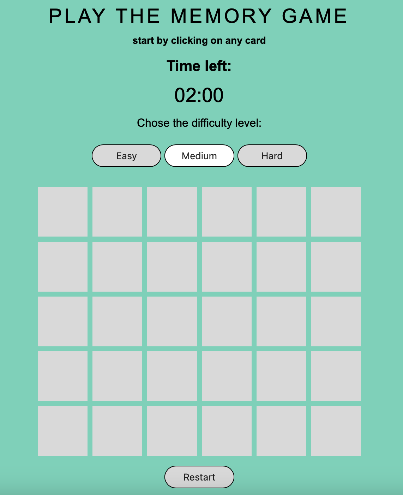
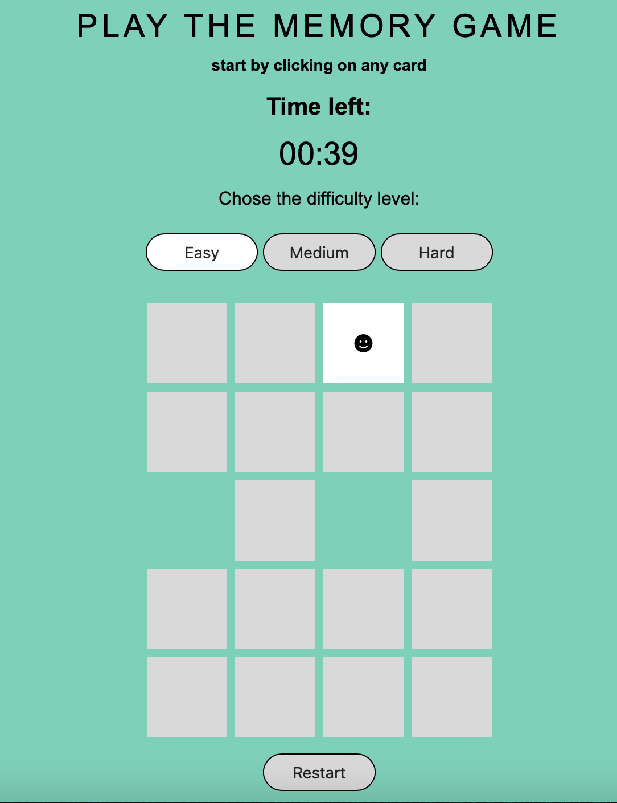
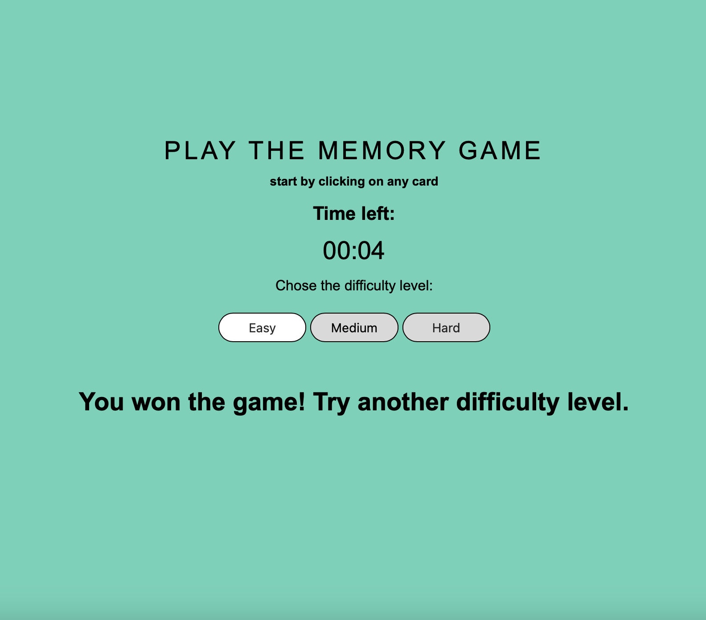

# Memory Game
Welcome to the ["Memory Game"](https://nashare.github.io/Memory-Game/)! This engaging and addictive game is designed to challenge your memory and provide endless fun. Test your ability to match pairs of cards with various icons while racing against the clock. The game comes with three difficulty levels, so you can choose the one that suits you best. Play, improve your memory, and have a great time!
### How to Play
The game board displays a grid of cards, each with an icon hidden on the back. The objective is to match pairs of cards with the same icon by flipping them over, one at a time. When you successfully match a pair, the cards will disappear from the board. The game continues until you have matched all the pairs or the time runs out.

### Game Features
* Difficulty levels: Choose from easy, medium, or hard modes, with the number of cards and the time limit varying based on your selection.
* Timer: Keep track of the remaining time with the on-screen timer.
* Responsive design: The game board adapts its layout according to the number of cards, ensuring an optimal playing experience.

## Screenshots

## Technologies Used
HTML, CSS, JavaScript

## Getting Started
https://nashare.github.io/Memory-Game/
## Next Steps
I plan to recreate this project using React framework
